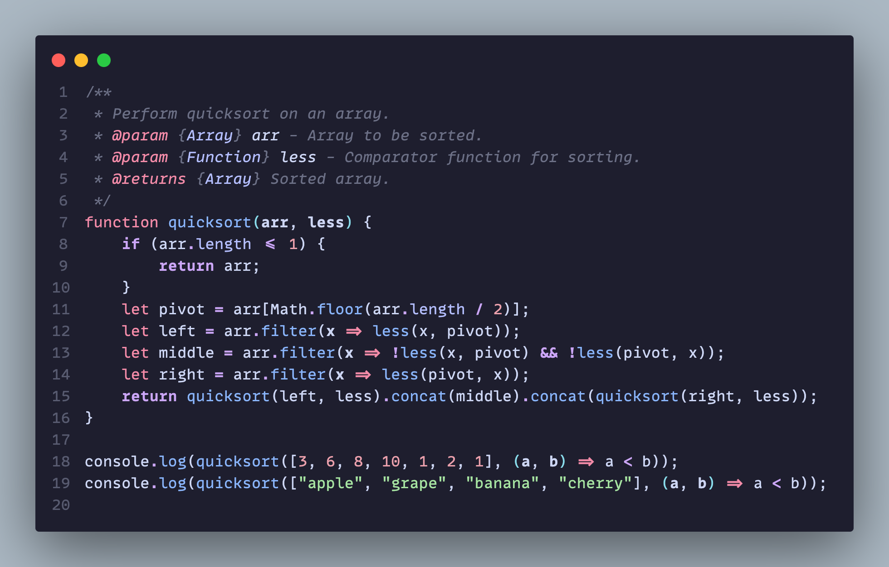

# Catppuccin Noctis!


*logo by Eric Dauenhauer. Check out his other generative art and cool pieces at https://ericyd.com/generative-art/*
## TL,DR
This theme takes [Noctis](https://github.com/liviuschera/noctis) syntax highlighting while using the increasingly popular [Catpuccin](https://github.com/catppuccin/catppuccin) palette. A bit of added personal flair as well and color scheme is tuned for python. Enjoy!

## Sample Images
### Python
Alt Mocha

Mocha

Macchiato

Frappe

Latte

### Typescript

### Javascript

### Java

### C++

### C#

### Go

### Rust


## Description
I absolutely love the syntax highlighting in the [Noctis](https://github.com/liviuschera/noctis) theme by Liviu Schera, but [Catppuccin](https://github.com/catppuccin/catppuccin) is absolutely blowing up right now and it is such a nice palette, I had to try to combine the two. This is the result!

## 👍 For Best Experience 👍
add bracket pair colorization to your `settings.json`
```
{
    "editor.bracketPairColorization.enabled": true,
    "editor.guides.bracketPairs": "active",
}
```
**Enjoy!**
